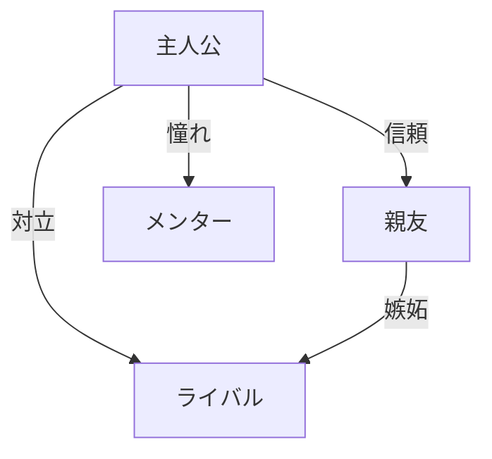

# 推奨ワークフロー

## 🗓️ 3週間集中創作プログラム

### Week 1: キャラクター確立

#### Day 1-2: 主人公の創造
**目標**：魅力的で一貫性のある主人公を作る

```
タイムテーブル：
09:00-09:30 CHARACTER.mdを読み込み、理解
09:30-10:30 基本情報記入とブレインストーミング
10:30-11:30 AIとの対話（5ステップ法）
11:30-12:00 一貫性チェックと修正
```

**使用ツール**：
- `character-template/CHARACTER.md`
- `character-template/character-prompts.md`
- お好みのAI（Claude, ChatGPT等）

#### Day 3-4: サブキャラクターの設計
**目標**：主人公を引き立てる脇役を作る

チェックリスト：
- [ ] 主人公との関係性を明確に
- [ ] それぞれ異なる価値観を設定
- [ ] 役割分担を明確に

#### Day 5-6: キャラクター相関図
**目標**：人間関係のダイナミクスを設計



#### Day 7: 週次レビュー
- キャラクターの魅力度評価
- 設定の整合性確認
- 次週への準備

---

### Week 2: 物語構築

#### Day 8-9: プロット作成
**目標**：骨太な物語の骨組みを作る

```
作業手順：
1. STORY.md Phase 1を完成
2. テーマを明確に言語化
3. 3幕構成を詳細化
4. 起承転結の確認
```

#### Day 10-11: 重要シーンの特定
**目標**：物語の山場を明確にする

重要シーンの基準：
- 🎭 感情が大きく動く
- 🔄 物語が転換する
- 💡 テーマが表現される
- 🎯 読者の期待に応える

#### Day 12-13: シーン詳細設計
**目標**：各シーンを映像的に構築

```yaml
シーン設計シート:
  外的要素:
    場所: 具体的に
    時間: 明確に
    天候: 雰囲気作り
  内的要素:
    感情: 変化を追う
    葛藤: 明確に
    決断: 具体的に
```

#### Day 14: 週次レビュー
- プロットの完成度確認
- ペース配分の検証
- 執筆準備の最終確認

---

### Week 3: 執筆と改善

#### Day 15-17: 第一稿執筆
**目標**：完璧を求めず、最後まで書き切る

```
執筆リズム:
━━━━━━━━━━━━━━━━━━━
09:00-11:00 執筆（2時間）
11:00-11:15 休憩
11:15-12:15 執筆（1時間）
━━━━━━━━━━━━━━━━━━━
目標: 1日1,500-2,000字
```

**執筆のコツ**：
- 編集しながら書かない
- 疑問点はメモして進む
- リズムを大切に

#### Day 18-19: 品質チェック
**目標**：客観的に作品を評価

使用ツール：
- `quality-check/checklist.md`
- 5軸評価（各10点満点）
- 改善点の優先順位付け

#### Day 20: 修正と仕上げ
**目標**：重要な問題を解決

修正の優先順位：
1. ❗ キャラクターの一貫性
2. ❗ 物語の論理性
3. ⚠️ 文章の読みやすさ
4. 💭 細部の調整

#### Day 21: 最終確認
- 通し読みで全体確認
- タイトルの最終決定
- 完成の喜びを味わう

---

## 🔄 継続的改善サイクル

### 日次ルーティン（執筆期）

```
朝のルーティン（30分）:
1. 前日の内容を読み返す
2. 今日の目標を設定
3. キャラクター設定を確認
4. 執筆開始

夜のルーティン（30分）:
1. 今日書いた分を読み返す
2. 良かった点を3つ記録
3. 改善点を1つメモ
4. 明日の準備
```

### 週次レビューテンプレート

```markdown
## Week [N] レビュー

### 達成したこと
- 
- 
- 

### うまくいったこと
- 
- 

### 課題と対策
| 課題 | 原因 | 対策 |
|------|------|------|
|      |      |      |

### 来週の目標
1. 
2. 
3. 

### 気づきとメモ
```

---

## 🛠️ ツール活用ガイド

### Phase別推奨ツール

#### 構想期
- **マインドマップ**: アイデア整理
- **Pinterest**: ビジュアルイメージ
- **音楽**: 雰囲気作り

#### 執筆期
- **ポモドーロタイマー**: 集中力維持
- **Character.ai**: 対話シミュレーション
- **DeepL Write**: 文章推敲

#### 推敲期
- **読み上げソフト**: 客観的確認
- **印刷**: 紙での確認
- **共有**: フィードバック収集

---

## 💡 創作のコツ

### 行き詰まった時の対処法

#### 1. キャラクターと対話
```
プロンプト例：
「あなたは[キャラクター名]です。
今、[状況]にいます。
何を考えていますか？」
```

#### 2. 視点を変える
- 別キャラクターの視点で見る
- 読者の立場で読み返す
- 1週間寝かせる

#### 3. 制約を加える
- 文字数を半分に
- 別ジャンルで書き直す
- 5分で要約する

### モチベーション維持

#### 進捗の可視化
```
執筆カレンダー:
月 火 水 木 金 土 日
✓  ✓  ✓  ✓  ✓  ✓  ✓
↑毎日少しでも書いたら✓
```

#### 小さな報酬
- 1,000字書いたら好きな飲み物
- 1章完成したら映画鑑賞
- 完成したら自分へのご褒美

---

## 📈 スキルアップの道

### Level 1: 基礎固め（1-3作品目）
- テンプレートに従って書く
- 短編から始める
- 完成を最優先

### Level 2: 応用展開（4-10作品目）
- テンプレートをカスタマイズ
- 中編に挑戦
- 複数キャラクターの管理

### Level 3: 独自スタイル（11作品目以降）
- 自分だけのテンプレート作成
- 長編への挑戦
- ジャンルの融合

---

## 🎯 成功指標

### 定量的指標
- [ ] 予定通り完成したか
- [ ] 目標文字数を達成したか
- [ ] 品質スコア40点以上か

### 定性的指標
- [ ] 書いていて楽しかったか
- [ ] キャラクターが生きていたか
- [ ] 伝えたいことが伝わったか
- [ ] また書きたいと思うか

---

## 🚀 次のステップ

### 作品完成後のアクション
1. **1週間寝かせる** - 客観性を取り戻す
2. **推敲と修正** - 品質向上
3. **共有** - フィードバックを得る
4. **振り返り** - 学びを記録
5. **次回作の構想** - 継続が力

### コミュニティ活用
- 作品を共有する勇気
- 他者の作品から学ぶ
- 創作仲間を見つける
- 切磋琢磨する環境

---

🌟 **Remember**: 完璧な第一稿はありません。大切なのは、書き始め、書き続け、書き終えること。そして、次へ進むことです。