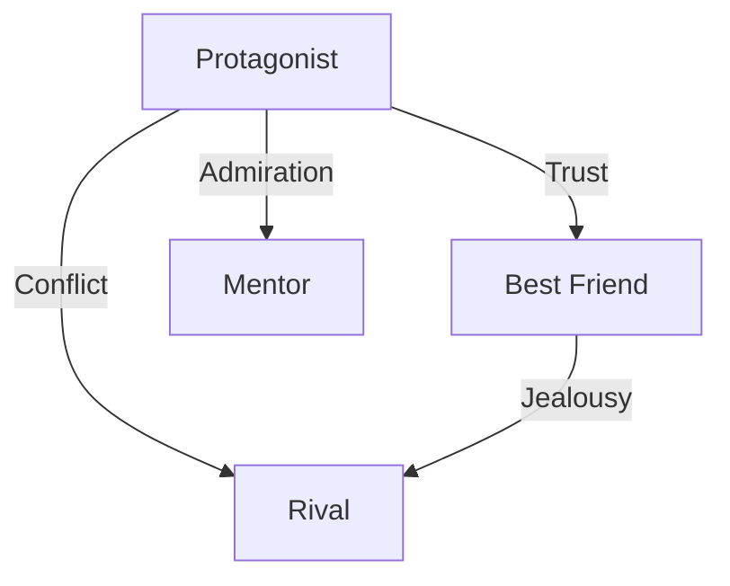

# Recommended Workflow

## 🗓️ 3-Week Intensive Creation Program

### Week 1: Character Establishment

#### Day 1-2: Protagonist Creation
**Goal**: Create a compelling and consistent protagonist.

```
Timetable:
09:00-09:30 Read and understand CHARACTER.md
09:30-10:30 Fill in basic information and brainstorm
10:30-11:30 Dialogue with AI (5-step method)
11:30-12:00 Consistency check and revisions
```

**Tools to use**:
- `character-template/CHARACTER.md`
- `character-template/character-prompts.md`
- Your preferred AI (Claude, ChatGPT, etc.)

#### Day 3-4: Design of Sub-characters
**Goal**: Create supporting characters that complement the protagonist.

Checklist:
- [ ] Clarify relationship with the protagonist
- [ ] Set different values for each
- [ ] Clarify role division

#### Day 5-6: Character Correlation Diagram
**Goal**: Design the dynamics of human relationships.



#### Day 7: Weekly Review
- Evaluate character appeal
- Confirm setting consistency
- Prepare for the next week

---

### Week 2: Story Construction

#### Day 8-9: Plot Creation
**Goal**: Create a solid story framework.

```
Work Procedure:
1. Complete STORY.md Phase 1
2. Clearly verbalize the theme
3. Detail the 3-act structure
4. Confirm the story arc (beginning, development, turn, conclusion)
```

#### Day 10-11: Identification of Important Scenes
**Goal**: Clarify the story's high points.

Criteria for important scenes:
- 🎭 Emotions run high
- 🔄 The story takes a turn
- 💡 The theme is expressed
- 🎯 Meets reader expectations

#### Day 12-13: Detailed Scene Design
**Goal**: Construct each scene visually.

```yaml
Scene Design Sheet:
  External Elements:
    Location: Specific
    Time: Clear
    Weather: Atmosphere creation
  Internal Elements:
    Emotion: Track changes
    Conflict: Clear
    Decision: Specific
```

#### Day 14: Weekly Review
- Confirm plot completeness
- Verify pacing
- Final check of writing preparations

---

### Week 3: Writing and Improvement

#### Day 15-17: First Draft Writing
**Goal**: Write to the end without aiming for perfection.

```
Writing Rhythm:
━━━━━━━━━━━━━━━━━━━
09:00-11:00 Writing (2 hours)
11:00-11:15 Break
11:15-12:15 Writing (1 hour)
━━━━━━━━━━━━━━━━━━━
Goal: 1,500-2,000 characters per day
```

**Writing Tips**:
- Don't edit while writing.
- Note down questions and move on.
- Value rhythm.

#### Day 18-19: Quality Check
**Goal**: Evaluate the work objectively.

Tools to use:
- `quality-check/checklist.md`
- 5-axis evaluation (max 10 points each)
- Prioritize areas for improvement.

#### Day 20: Revision and Finishing
**Goal**: Solve important problems.

Revision Priority:
1. ❗ Character consistency
2. ❗ Story logic
3. ⚠️ Readability of text
4. 💭 Fine-tuning details

#### Day 21: Final Confirmation
- Read through the entire work for a final check.
- Finalize the title.
- Savor the joy of completion.

---

## 🔄 Continuous Improvement Cycle

### Daily Routine (During Writing Phase)

```
Morning Routine (30 minutes):
1. Reread the previous day's content.
2. Set today's goals.
3. Review character settings.
4. Start writing.

Evening Routine (30 minutes):
1. Reread what was written today.
2. Record 3 things that went well.
3. Note down 1 point for improvement.
4. Prepare for tomorrow.
```

### Weekly Review Template

```markdown
## Week [N] Review

### Accomplishments
- 
- 
- 

### What Went Well
- 
- 

### Challenges and Countermeasures
| Challenge | Cause | Countermeasure |
|-----------|-------|----------------|
|           |       |                |

### Goals for Next Week
1. 
2. 
3. 

### Insights and Memos
```

---

## 🛠️ Tool Usage Guide

### Recommended Tools by Phase

#### Conceptualization Phase
- **Mind Map**: Idea organization
- **Pinterest**: Visual inspiration
- **Music**: Atmosphere creation

#### Writing Phase
- **Pomodoro Timer**: Maintain focus
- **Character.ai**: Dialogue simulation
- **DeepL Write**: Text revision

#### Revision Phase
- **Text-to-speech software**: Objective review
- **Printing**: Review on paper
- **Sharing**: Feedback collection

---

## 💡 Creation Tips

### How to Deal with Writer's Block

#### 1. Converse with the Character
```
Example Prompt:
"You are [Character Name].
You are currently in [situation].
What are you thinking?"
```

#### 2. Change Perspective
- See from another character's point of view.
- Reread from the reader's standpoint.
- Let it sit for a week.

#### 3. Add Constraints
- Halve the character count.
- Rewrite in a different genre.
- Summarize in 5 minutes.

### Maintaining Motivation

#### Visualize Progress
```
Writing Calendar:
Mon Tue Wed Thu Fri Sat Sun
✓   ✓   ✓   ✓   ✓   ✓   ✓
↑ Check if you wrote even a little each day
```

#### Small Rewards
- Favorite drink after writing 1,000 characters.
- Watch a movie after completing a chapter.
- Treat yourself upon completion.

---

## 📈 Path to Skill Improvement

### Level 1: Solidifying Basics (1st-3rd work)
- Write according to the template.
- Start with short stories.
- Prioritize completion.

### Level 2: Applied Development (4th-10th work)
- Customize templates.
- Try writing medium-length stories.
- Manage multiple characters.

### Level 3: Unique Style (11th work onwards)
- Create your own templates.
- Challenge yourself with long-form stories.
- Fuse genres.

---

## 🎯 Success Indicators

### Quantitative Indicators
- [ ] Was it completed on schedule?
- [ ] Was the target character count achieved?
- [ ] Is the quality score 40 points or higher?

### Qualitative Indicators
- [ ] Was it enjoyable to write?
- [ ] Did the characters feel alive?
- [ ] Was the intended message conveyed?
- [ ] Do you want to write again?

---

## 🚀 Next Steps

### Actions After Completing a Work
1. **Let it sit for 1 week** - To regain objectivity.
2. **Revise and correct** - Improve quality.
3. **Share** - Get feedback.
4. **Reflect** - Record learnings.
5. **Plan next work** - Continuation is power.

### Utilizing the Community
- Courage to share your work.
- Learn from others' works.
- Find creative companions.
- An environment for friendly competition.

---

🌟 **Remember**: There is no perfect first draft. What's important is to start writing, keep writing, and finish writing. And then, to move on to the next thing.